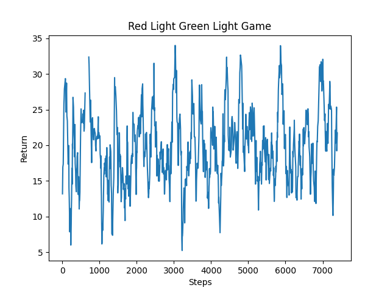
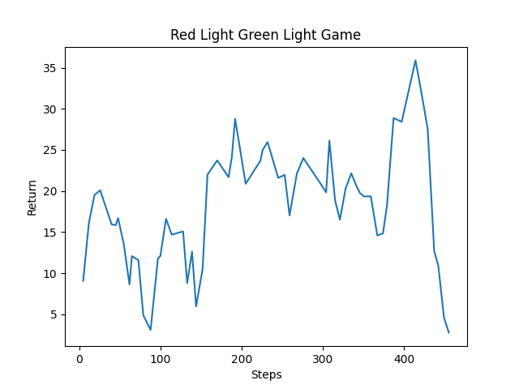
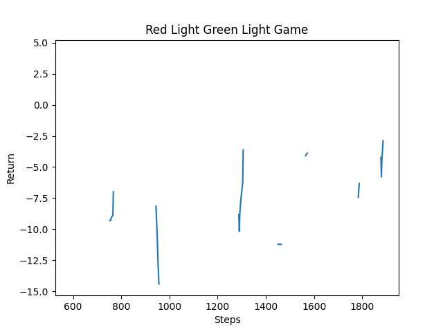

---
layout: default
title: Final Report
---


## Video
[FIXME: THIS IS THE OLD VIDEO]
<iframe width="560" height="315" src="https://www.youtube.com/embed/UDfAS55aF24" title="YouTube video player" frameborder="0" allow="accelerometer; autoplay; clipboard-write; encrypted-media; gyroscope; picture-in-picture" allowfullscreen></iframe>


## Project Summary

Our project is based on the game “Red Light Green Light” depicted in the popular Netflix show, Squid Game. Our agent will spawn at one end of an arena, and attempt to reach the finish line at the other end as efficiently as possible. At the end of the arena (farthest from the agent spawn), there is a line of blocks denoting the finish line and 5 light blocks. These light blocks will repeatedly light up sequentially from left to right. The agent will need to read these light blocks from the observation space, and move only when the rightmost light is unlit. In other words, the agent will be eliminated if it moves while the rightmost light is lit. Through rewards and penalties, the agent should ultimately learn to stop moving when the rightmost light (the "Red light") is lit and to anticipate this light turning on. 

To further increase the complexity of this task, we have implemented additional features. The first is that the duration or “delta” between the light blocks will vary between rounds. This will prevent the agent from quickly memorizing the timing of the lights, and instead require it to learn to stop moving before the last light turns on. 

Additionally, the agent must contend with a momentum wrapper that we have added to Malmo. This will simulate real movement by implementing acceleration and momentum into the agent's movements. The wrapper effectively prevents the agent from stopping immediately before the last light is turned on, and from starting to move immediately when the last light is turned off. This adds further complexity because the agent must learn when to start slowing down based on the duration between the lights of that particular sequence. 

The agent is also rewarded and penalized for moving forward toward the goal and backward toward the starting point, respectively. The acceleration/momentum wrapper directly affects the speed of the agent and works with these rewards and penalties, regardless of which direction the agent moves in. 

We have also included obstacles throughout the arena to add further challenges to our agent’s mission. More specifically, lava pits are spawned in random locations, at the start of each mission, and the agent must avoid them on its path to the finish line. If the agent touches any of these lava pits, it is eliminated and penalized. To allow the agent to avoid the pits, the agent is able to strafe left and right; however, the agent is not able to turn.


## Approaches

Experimented with timing but the agent wasnt performing well. The model was too complex and the number of parameters became overwhelming for our agent to learn.
approaches


Generally the agent has 2 degrees of freedom in terms of movement: forwards and backwards, as well as side to side strafing. The agent's performance and learning is based on the decisions it makes. Two key areas determine the agent's success and failure. The distance moved forward is one area, where the agent is rewarded for each ‘row of blocks’ that it moves forwards and penalized for each ‘row of blocks’ that it moves backwards. The rewards for this are +1 and -1 respectively. Side to side strafing is also enabled, to present the agent with the ability to move away from the lava pits. 
The second area to determine the agent's success is the win and fail conditions. The win condition is if the agent reaches the iron row at the back of the arena. Should the agent succeed, it is awarded with +100 in addition to the movement reward. The fail condition is if the agent moves while the last light is turned on, and it is given a -10 penalty.


Our first approach is the baseline approach. The agent is constricted to one degree of freedom, as opposed to the more general two degrees of freedom listed above. This allows us to have a baseline test with minimal variables; the agent can move forwards or stop. Running this test will enable us to understand how introducing new variables, such as backwards movement and lava pits, affect the agent's success. This approach might need less data and be more accurate as there are less areas for failure for the agent. In this approach we kept the world loading the same in each iteration. We also cap the lower bound of velocity to 0 initially, to ensure that the agent is either stationary or moving in the positive direction.

Lastly this approach calculates the reward for movement through XML, using the XML block type: RewardForReachingPosition. The below code writes XML code for the entire play space, giving a reward of 1 for each row of blocks it passes through.
```
def get_all_movement_reward_locations():
    out = ""
    i = 826.5
    while (i >= 777.5):
        out += f"<RewardForReachingPosition> <Marker x='624.5' y='4' z='{i}'/> </RewardForReachingPosition>"
        i -= 3

    return out
```

In our next approach the agent is given the ability to move backwards. The addition of this ability does not help the agent, however it is now a new variable that the agent must contend with. The lower bound of the velocity is now -1.0 instead of 0. This approach may be less accurate, but the agent must learn directional movement. The reward and penalty for movement in this approach is through taking the difference of the agents position on the z-axis instead of through XML

The last approach includes strafing and obstacles. The environment now has lava first randomly generated for each run. The agent will die if it falls into the lava (reward of -1), and is given a negative reward. Additionally, the agent is given the ability to strafe right or left (but not turn). In order to enable these functionalities we had to use a new technique when loading the world. In previous approaches, our world was loaded from a custom file. However, to add custom lava pits, we had to utilize XML, which does not work with a custom world as the lava persists between restarts. Therefore, for each iteration, we copied the world into a different directory and loaded this copied world.  This would allows us to change the world and add lava pits without modifying the original. add code for loading


## Evaluation

Currently, our methods of evaluation consist of the agent’s performance based on completion, directional distance travelled, and efficiency of the path. Our evaluation of completion is reliant on many factors affected by the agent’s movements. More specifically, while the only way the agent can complete the mission is to reach the finish line, there are multiple ways for the agent to fail to complete the mission. For example, if the agent touches a lava pit (in one approach) or moves while the last light is on (in all approaches), it is eliminated from the game. In any case, the agent is rewarded or penalized, according to the outcome observed. 
Similarly, our evaluation of directional distance travelled is determined solely by whether the agent moves forward or backward. Specifically, for each step that the agent takes forward, it is rewarded slightly, and for each step that the agent takes backward, it is penalized by the same amount. This method of evaluation ensures that the agent learns the importance of incrementally taking steps forward, rather than backward, and the objective of the game, which is to reach the finish line without moving while the rightmost light is on. 
Our evaluation of the efficiency of the path is mainly determined by the left and right strafing of the agent. To improve the efficiency of our agent’s movements, we have also considered rewarding or penalizing the agent for moving left and right unnecessarily; however this proved to be ineffective. We found that disregarding left and right movements of the agent, for the purposes of training, was satisfactory, as it allowed the agent to discover an efficient path, avoiding the obstacles, without any consequences for doing so. 
 
Our qualitative evaluation of the agent’s performance is based on similar principles. To evaluate completion, we consider the mission a success if the agent reaches the finish line, and we consider it a failure if the agent moves while the rightmost light is on or if the agent touches a lava pit. In any of these cases, the mission ends and the agent is removed from the game. We also consider any unnecessary moves that the agent makes. Specifically, we want to minimize backward movements from the agent. While backward movements may be necessary in some scenarios, due to the obstacles we have included in the arena, moving backward is usually inefficient and it can be seen visually. In this sense, we evaluate the “smoothness” of the agent’s movements, where the agent stops in anticipation of the rightmost light turning on, remains immobile for the entire duration, and begins moving immediately after it turns off. This will require preemptive stopping and moving from the agent, due to the implementation of acceleration and momentum within our agent. Ultimately, we want to see the agent move as efficiently as possible, to minimize the amount of time it takes to reach the finish line. 
 
Below are plots of our agent’s performance across numerous rounds of training and with various learning algorithms and environments:
 

PPO Algorithm; Forward Movement Only Without Lava Pits
 
 
IMAPALA Algorithm; Forward and Backward Movement Without Lava Pits
 

PPO Algorithm; Forward and Backward Movement and Strafing with Lava Pits 
 
Description of plots:
    - The results of this approach...
    - from the graph and watching the agent train, it is shown that the agent can only learn one or the other: moving aound the lava or not moving while the last light is on. The agent struggles when both are variables

 


## References

- [Minecraft Wiki](https://minecraft.fandom.com/wiki/Minecraft_Wiki)
- [Project Malmo Documentation](https://microsoft.github.io/malmo/0.30.0/Documentation/index.html)
- [Malmo and RLlib Tutorials Youtube Playlist](https://www.youtube.com/playlist?list=PLa9uQbheNAMn7QuE-OnXBGWfRyVGiJSpU)
- [Project Malmo Gitter](https://gitter.im/Microsoft/malmo)
- [Ray Documentation](https://docs.ray.io/en/latest/rllib.html)
- [Gym Documentation](http://gym.openai.com/docs/)
- [Python Documentation](https://docs.python.org/3/)
- [Malmo GitHub Forum](https://github.com/microsoft/malmo-challenge/issues/36)
