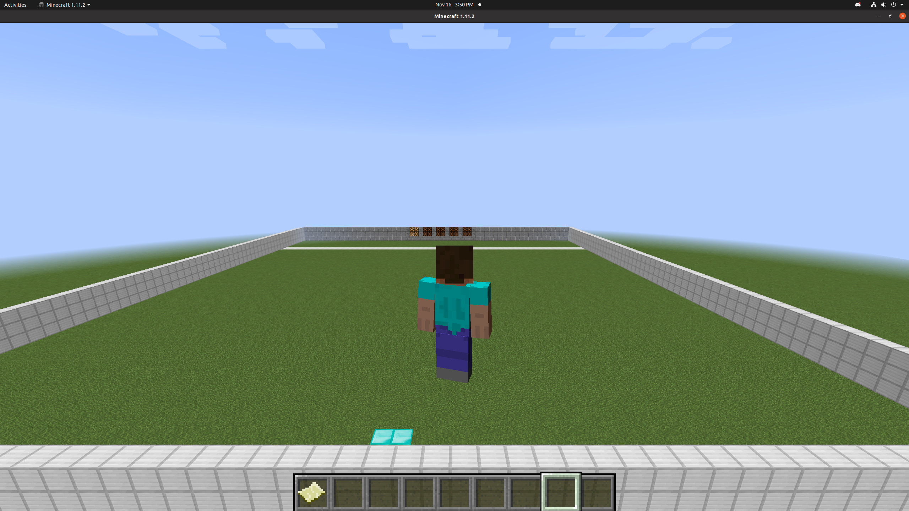
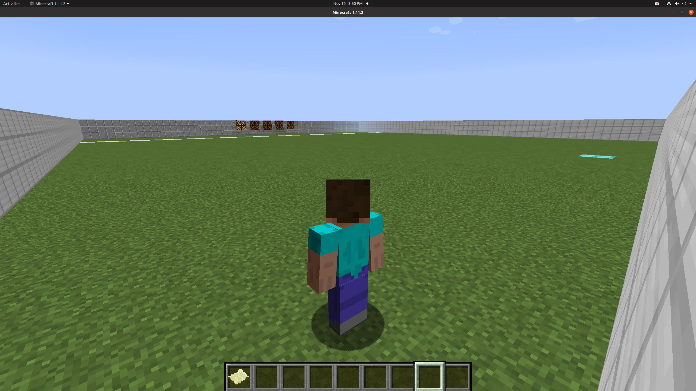
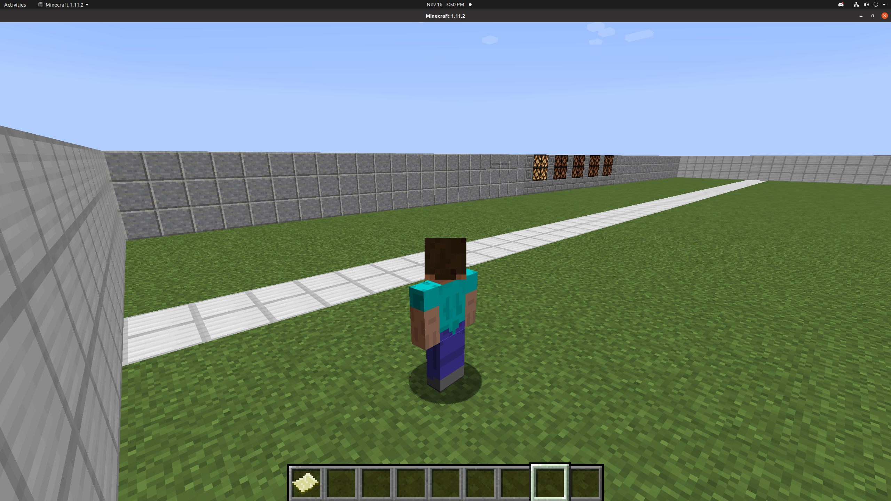
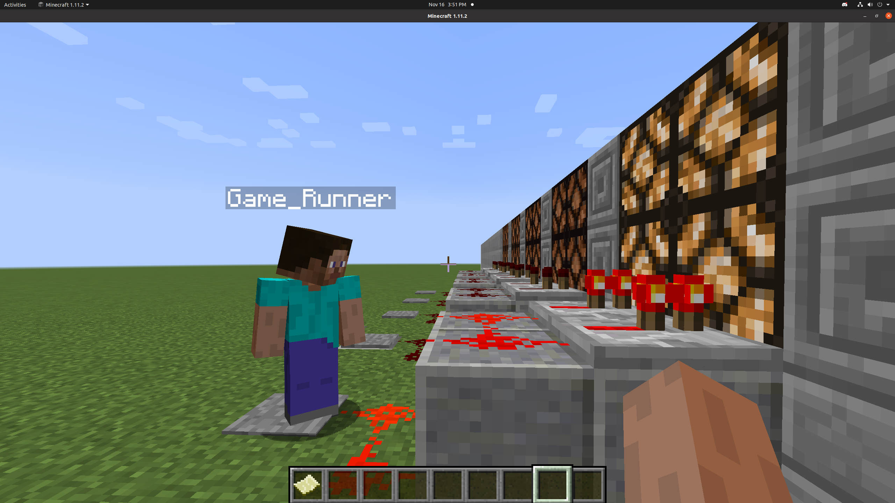
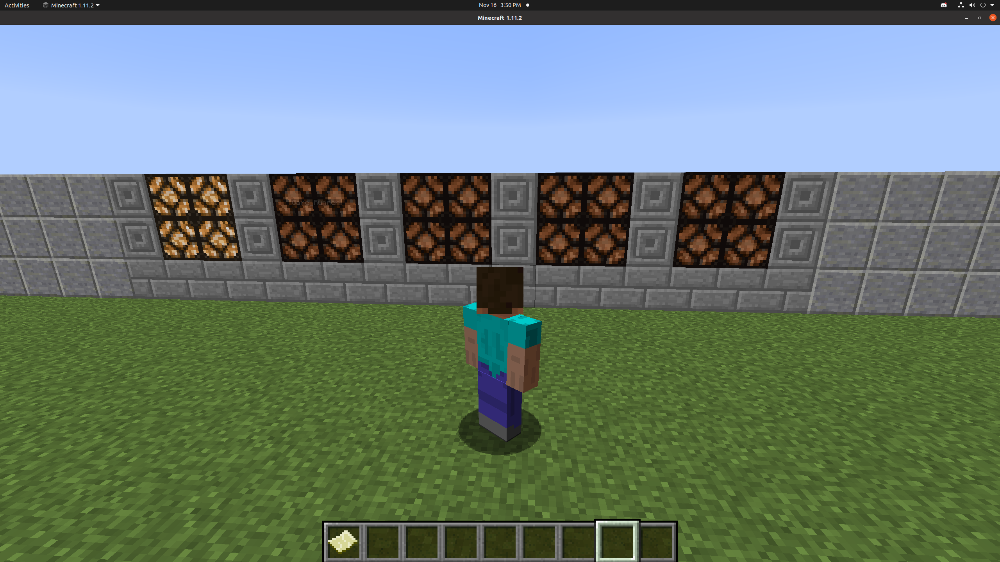
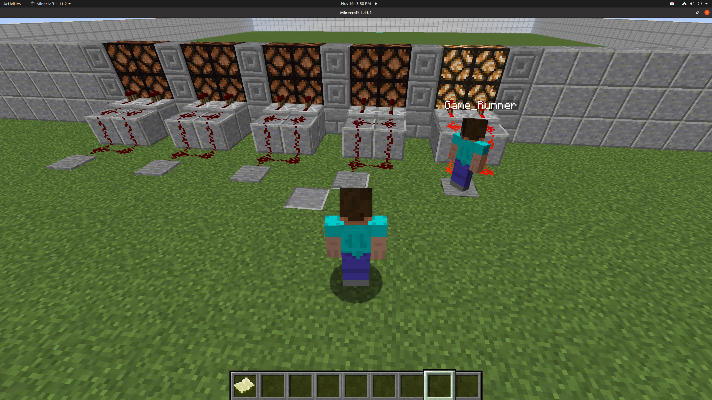
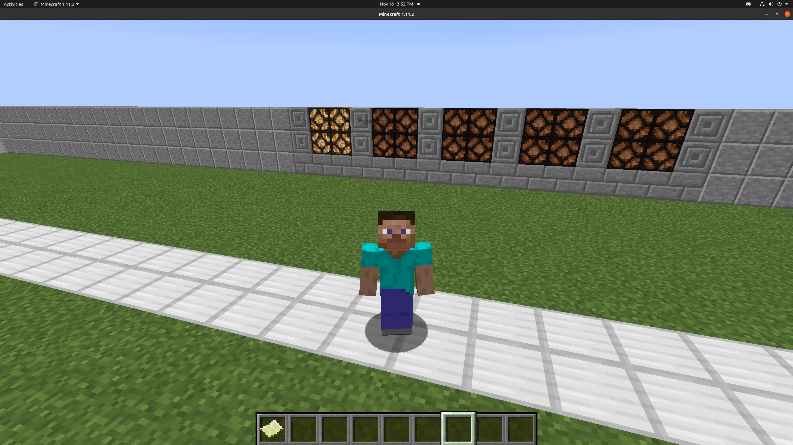

## Source Code 

https://github.com/timothyzhu1/Red-Light-Green-Light

## Reports

- [Proposal](proposal.html)
- [Status](status.html)
- [Final](final.html)

## Project Summary

Our project is based on the game, Red Light Green Light, depicted in the popular Netflix show, Squad Game. Our agent will spawn at one end of an arena, endeavouring to reach the finish line at the other end. There are five light blocks aligned next to each other, shortly past the finish line, that will each be either lit or unlit at any given time. The light blocks will repeatedly light up sequentially from left to right. The agent is only allowed to move when the rightmost light is unlit. In other words, the agent will be eliminated if it moves while the rightmost light lit. Through rewards and penalties, the agent should ultimately learn to stop moving when the rightmost light (the "red light") is lit and to anticipate this light turning on, since the duration of each light block being on will vary between rounds. To add complexity to our project, we simulate real movement by implementing an acceleration and momentum wrapper to Malmo. This wrapper effectively prevents the agent from immediately stopping and starting to move, requiring the agent to take time and speed into account in order to anticipate when to begin slowing down.

## Gallery

Arena

Arena

Finish line

Game Runner Agent

Lights

Light Switches

Agent Reached Finish Line

## Relevant Resources Used

- [Minecraft Wiki](https://minecraft.fandom.com/wiki/Minecraft_Wiki)
- [Project Malmo Documentation](https://microsoft.github.io/malmo/0.30.0/Documentation/index.html)
- [Malmo and RLlib Tutorials Youtube Playlist](https://www.youtube.com/playlist?list=PLa9uQbheNAMn7QuE-OnXBGWfRyVGiJSpU)
- [Project Malmo Gitter](https://gitter.im/Microsoft/malmo)
- [Ray Documentation](https://docs.ray.io/en/latest/rllib.html)
- [Gym Documentation](http://gym.openai.com/docs/)