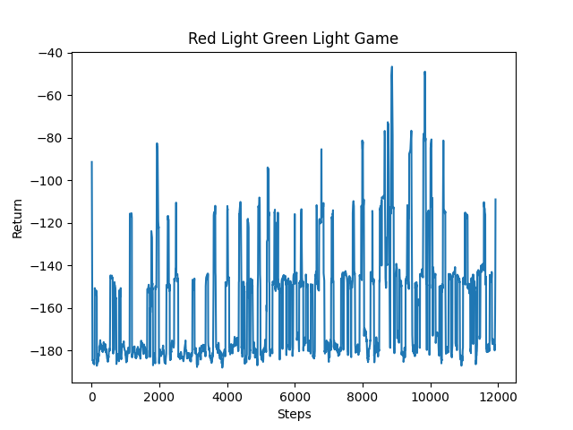
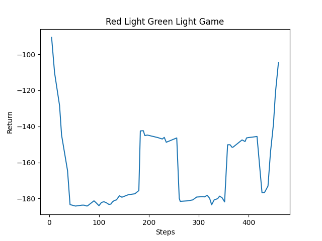
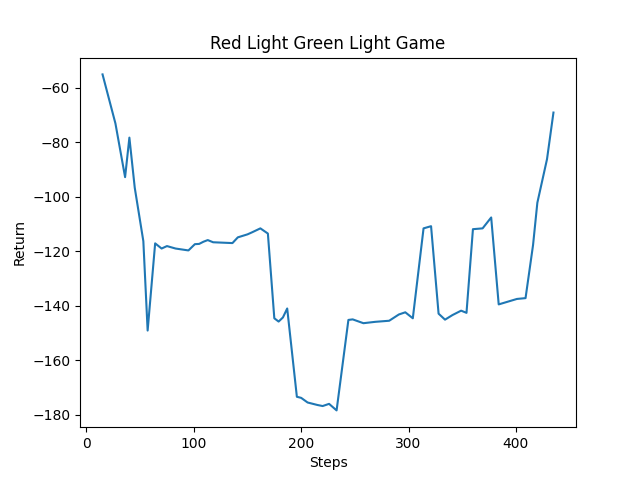

## Project Summary

Our project is based on the game, Red Light Green Light, depicted in the popular Netflix show, Squid Game. Our agent will spawn at one end of an arena, endeavouring to reach the finish line at the other end. There are five light blocks aligned next to each other, shortly past the finish line, that will each be either lit or unlit at any given time. The light blocks will repeatedly light up sequentially from left to right. The agent is only allowed to move when the rightmost light is unlit. In other words, the agent will be eliminated if it moves while the rightmost light is lit. Through rewards and penalties, the agent should ultimately learn to stop moving when the rightmost light (the "red light") is lit and to anticipate this light turning on, since the duration of each light block being on will vary between rounds. To add complexity to our project, we simulate real movement by implementing an acceleration and momentum wrapper to Malmo. This wrapper effectively prevents the agent from immediately stopping and starting to move, requiring the agent to take time and speed into account in order to anticipate when to begin slowing down.

## Approach

## Evaluation

Currently, our methods of evaluation consist of the agent's performance based on completion and distance travelled forward. Specifically, for each step that the agent takes forward, it is rewarded slightly, and for each step that the agent takes backward, it is penalized by the same amount. To reward completion of the game, the agent will be rewarded immensely if it reaches the finish line. Similarly, it will be penalized immensely if it moves while the rightmost light is on. This method of evaluation ensures that the agent learns the importance of incrementally taking steps forward, rather than backward, and the objective of the game, which is to reach the finish line without moving while the rightmost light is on. Below are plots of our agent's performance across numerous rounds of training and with various learning algorithms:

PPO Algorithm

IMPALA Algorithm

Another Iteration of the IMPALA Algorithm

Our qualitative evaluation of the agent's performance is based on similar principles. We consider the mission a success if the agent reaches the finish line, and we consider it a failure if the agent moves while the rightmost light is on. We are also considering the unnecessary moves that the agent makes. Specifically, we want to eliminate any backward movement from the agent, entirely. Esepecially in this initial implementation of the arena, with no obstacles, there is no reason for the agent to ever move backward. In this sense, we evaluate the "smoothness" of the agent's movements, where the agent stops in anticipation of the rightmost light turning on, remains immobile for the entire duration, and begins moving immediately after it turns off. This will require preemptive stopping and moving from the agent, due to the implementation of acceleration and momentum within our agent. Ultimately, we want to see the agent move as efficiently as possible, to minimize the amount of time it takes to reach the finish line.

## Remaining Goals and Challenges

Currently, we have a minimal arena, with an agent that only moves in one direction. As a future enhancement of our project, we would like to implement a more complex arena for the agent to navigate. Specifically, we want to include obstacles throughout the arena, such as lava, and allow the agent to turn so it can avoid the obstacles. This means that we will also need to implement and additional penalty for backwards movement of the agent. 

We would also like to include a computer vision aspect in our project. Currently, we are simply retrieving the state of the light blocks and passing it to the agent's observations. An interesting change to our project may involve allowing the agent to make the observations itself, deriving the obstacles and the states of the lights through visual inputs from Malmo. 

Currently, we are solely evaluating our agent's performance based on completion and distance. In other words, our evaluation consists of whether the agent moves while the rightmost light is on, how far forward the agent is able to move, and whether it is able to reach the finish line. To increase complexity, we would also like to consider time performance. In other words, we will evaluate the agent based on how long it takes to reach the finish line, rewarding the agent for efficiency. In doing so, we hope to minimize the amount of unnecessary moves that the agent makes.

Currently, the size of our arena allows the agent to move large distances within each rotation of the lights. This may be problematic, as it decreases the amount of space that we can allow our agent to train on. For future iterations of our project, we hope to increase the size of the arena, which will also increase the amount of times the agent is required to stop. This will evaluate our agent more critically and put more emphasis on its learning.

TODO: OPTIMIZE AND IMPROVE ALG

With all these goals for our project will come challenges. Specifically, we are anticipating some limiations with both Minecraft in Malmo, in the sense that it may not be able to support the ideas we have. Some challenges we have faced already in this area is the implementation of different colored lights. We were hoping to use different colored lights and have the rightmost light be a red light. This is not supported in Minecraft, however, so we worked around this issue by using five different lights in a row to represent the lights changing. For example, we are unsure what kind of obstacles are feasible and whether we can possibly eliminate the agent with weapons used by another agent. Additionally, we are unsure if the computer vision aspect is feasible, given the remaining time we have in the course. While this project can definitely be an application of computer vision, training our agent with these visual inputs may be difficult and be beyond our capabilities, especially given the time constraint.

## Resources Used 

- [Minecraft Wiki](https://minecraft.fandom.com/wiki/Minecraft_Wiki)
- [Project Malmo Documentation](https://microsoft.github.io/malmo/0.30.0/Documentation/index.html)
- [Malmo and RLlib Tutorials Youtube Playlist](https://www.youtube.com/playlist?list=PLa9uQbheNAMn7QuE-OnXBGWfRyVGiJSpU)
- [Project Malmo Gitter](https://gitter.im/Microsoft/malmo)
- [Ray Documentation](https://docs.ray.io/en/latest/rllib.html)
- [Gym Documentation](http://gym.openai.com/docs/)